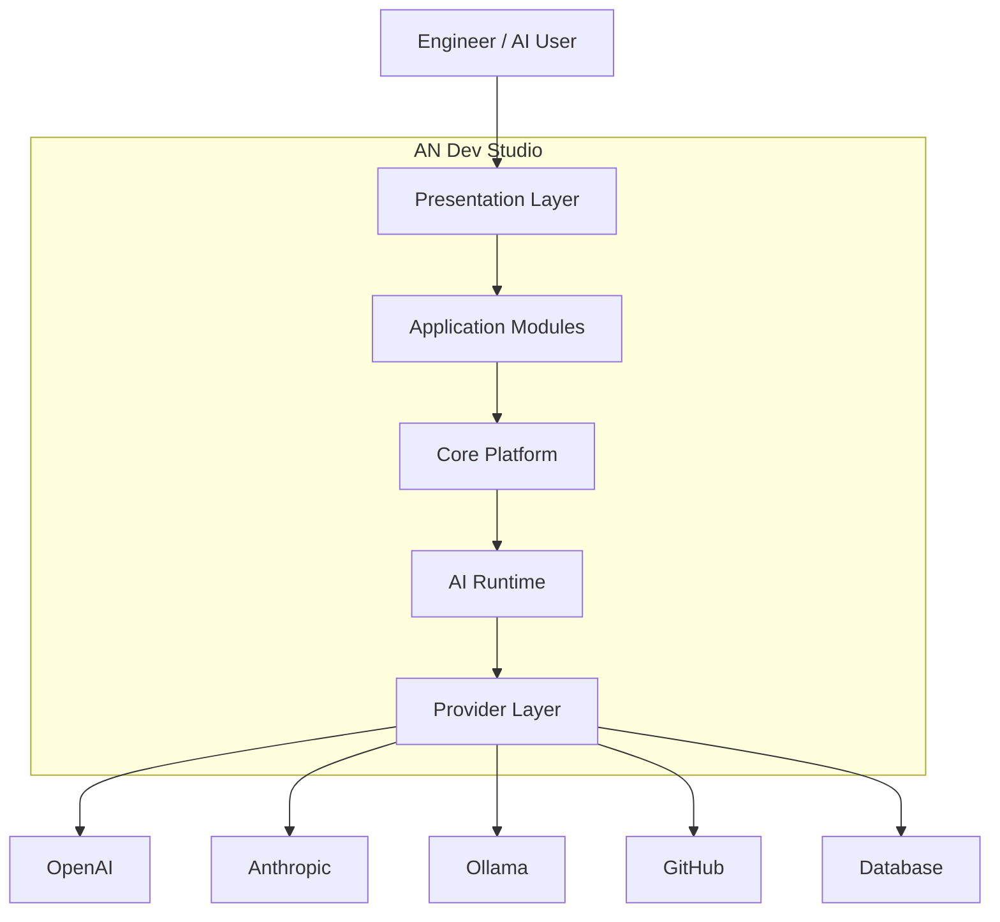
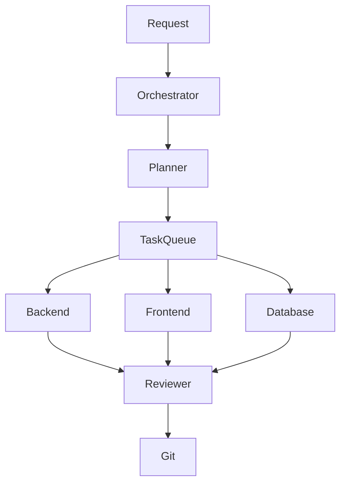

# AN Dev Studio System Architecture

## Purpose

This document defines the overall architecture of AN Dev Studio.

It establishes the system boundaries, application layers, dependency rules, module communication, and engineering principles that every implementation must follow.

No production code may violate this architecture without an approved Architecture Decision Record (ADR).

---

# High-Level Architecture



---

# Architecture Layers

The platform is divided into five major layers.

## Layer 1 — Presentation

Responsible for:

- User Interface
- Navigation
- Theme
- Layout
- User Interaction

Contains:

```
app/
shared/ui/
shared/layouts/
shared/icons/
```

Presentation never communicates directly with AI providers.

---

## Layer 2 — Modules

Business functionality lives here.

Examples:

- Dashboard
- Projects
- Git
- Settings
- Workspace
- AI
- Users

Every feature is implemented as a module.

Modules communicate only through Core services.

---

## Layer 3 — Core

Core provides shared infrastructure.

Examples:

- Configuration
- Authentication
- Logging
- Event Bus
- Service Registry
- Dependency Injection
- State Management

Core must never depend on Modules.

---

## Layer 4 — AI Runtime

Responsible for executing engineering workflows.

Responsibilities include:

- Agent Orchestration
- Prompt Management
- Context Management
- Memory
- Tool Execution
- Workflow Engine

The AI Runtime has no UI.

---

## Layer 5 — Providers

Responsible for communicating with external services.

Examples:

- OpenAI
- Anthropic
- Ollama
- GitHub
- GitLab
- Azure
- Local Models

Every provider implements a common interface.

---

# Repository Structure

```
an-dev-studio/

apps/
    studio/

packages/
    ai-core/
    config/
    shared/
    ui/

docs/
adr/
scripts/
tools/
```

---

# Studio Application Structure

```
apps/studio/src/

app/

core/

modules/

shared/

ai/

hooks/

services/

store/

types/

utils/

styles/
```

---

# Dependency Rules

The following dependencies are permitted.


Reverse dependencies are prohibited.

Example:

❌ Core importing Dashboard

❌ AI Runtime importing React components

❌ Providers importing UI

---

# Module Communication

Modules never communicate directly.

Instead:

```text
Project Module
        │
        ▼
Core Service
        │
        ▼
Git Module
```

This prevents tight coupling.

---

# AI Runtime Flow



Each agent performs one specialized responsibility.

---

# Plugin Architecture

The platform supports plugins.

Each plugin may register:

- Routes
- Sidebar Items
- Commands
- Settings
- AI Tools
- Workflows
- Services

Plugins must never modify Core.

Plugins extend Core through registration.

---

# Engineering Constraints

Every production component must satisfy:

- Single Responsibility Principle
- Dependency Inversion Principle
- Open/Closed Principle
- Strict TypeScript
- Zero Circular Dependencies
- Reusable Components
- Testable Services
- Configurable Behavior

---

# Future Expansion

The architecture must support:

- Desktop Application
- Mobile Companion
- Cloud Sync
- Self-hosted Deployment
- Enterprise Multi-tenancy
- Marketplace
- Plugin Store
- AI Knowledge Base

without redesigning the Core architecture.

---

# Architecture Principles

1. Architecture before implementation.
2. Configuration before customization.
3. Composition before inheritance.
4. Interfaces before implementations.
5. Platform before features.
6. Reuse before duplication.
7. Human approval before autonomous execution.

---

# Version History

| Version | Date | Description |
|----------|------------|-----------------------------|
| 1.0.0 | 2026-06-28 | Initial System Architecture |